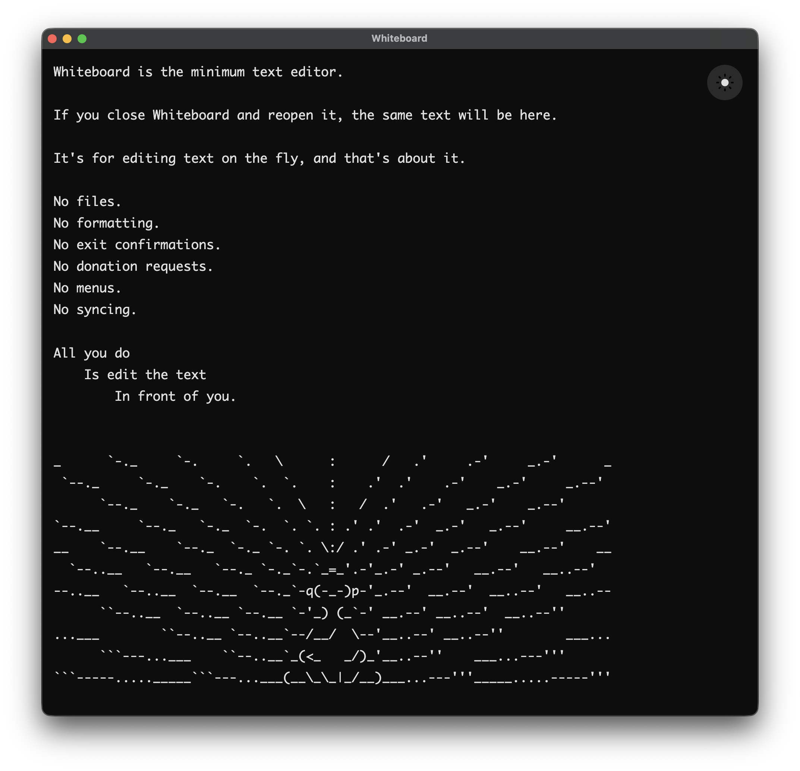

# Blackboard

Blackboard is an app for editing scratch text on the fly.

There's no save mechanism. Text just persists between sessions.

Write a SQL snippet, draft a slack message, modify a unix command, etc.

No tabs.  
No startup menus.  
No exit confirmations.  
No "unsaved" dot.  
No syncing.  

Just a little blackboard that's always the way you left it.



## Install (macOS)

### Disk image installer
1. Download the latest `.dmg` from [Releases](https://github.com/AndrewHannigan/blackboard/releases)
2. Open the DMG and drag Blackboard to Applications
3. Run this once in a terminal to bypass Gatekeeper
   ```bash
   xattr -cr /Applications/Blackboard.app
   ```
4. Open Blackboard


### Homebrew

1. Run `brew install --cask andrewhannigan/tap/blackboard`
2. Run this once in a terminal to bypass Gatekeeper
   ```bash
   xattr -cr /Applications/Blackboard.app
   ```
3. Open Blackboard

